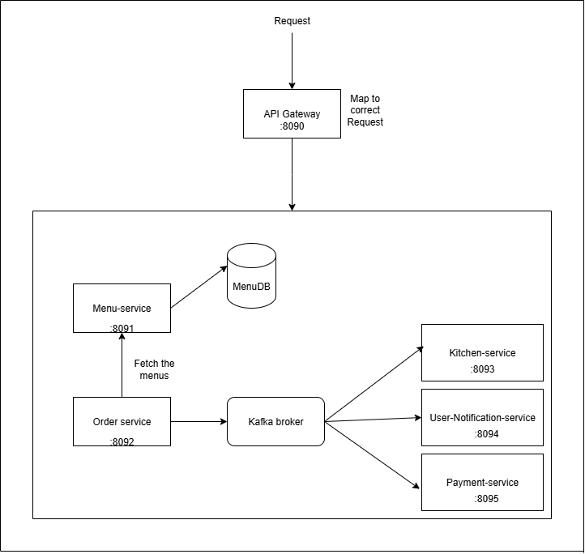

# Restaurant Architecture



# Configuration
#### application.properties for each service

#### Order Service

```
spring.application.name=order-service
server.port=8092
spring.kafka.bootstrap-servers=localhost:9092
spring.kafka.producer.key-serializer=org.apache.kafka.common.serialization.StringSerializer
spring.kafka.producer.value-serializer=org.springframework.kafka.support.serializer.JsonSerializer
resto.order.kafka.topic.name=<topic-name>
resto.order.kafka.groupid=<groupid>
```

#### Menu Service

```
spring.application.name=menu-service
server.port=8091
```

#### kitchen Service

```
spring.application.name=kitchen-service
server.port=8093
spring.kafka.bootstrap-servers=localhost:9092
spring.kafka.consumer.value-deserializer=org.springframework.kafka.support.serializer.JsonDeserializer
spring.kafka.consumer.key-deserializer=org.apache.kafka.common.serialization.StringDeserializer
spring.kafka.consumer.properties.spring.json.trusted.packages=*
resto.order.kafka.topic.name=<same-as-order-service>
resto.order.kafka.groupid=<same-as-order-service>
```

# Kafka

Leverage the docker-compose.yml file to automatically pull the required Kafka and Zookeeper images and run them as containers. This setup ensures that your Kafka server is consistently available for inter-service communication between the Order and Kitchen microservices. It also simplifies the local development environment by managing dependencies with a single command (docker-compose up).

## Installation

Create a docker-compose.yml file using the configuration provided below. This file defines the necessary services such as Kafka and Zookeeper, including their respective container images, ports, environment variables, and network settings.

```
version: '3.8'

services:
  zookeeper:
    image: wurstmeister/zookeeper
    container_name: zookeeper
    environment:
      ZOOKEEPER_CLIENT_PORT: 2181
      ZOOKEEPER_TICK_TIME: 2000
    ports:
      - "2181:2181"
    volumes:
      - zookeeper-data:/var/lib/zookeeper/data
      - zookeeper-log:/var/lib/zookeeper/log

  kafka:
    image: wurstmeister/kafka
    container_name: kafka
    depends_on:
      - zookeeper
    environment:
      KAFKA_ADVERTISED_HOST_NAME: localhost
      KAFKA_ZOOKEEPER_CONNECT: zookeeper:2181
    ports:
      - "9092:9092"
    volumes:
      - kafka-data:/var/lib/kafka/data

volumes:
  zookeeper-data:
  zookeeper-log:
  kafka-data:

```

on save folder where docker compose file created use below command to pull and run docker container.

```
sudo docker compose up -d
```


